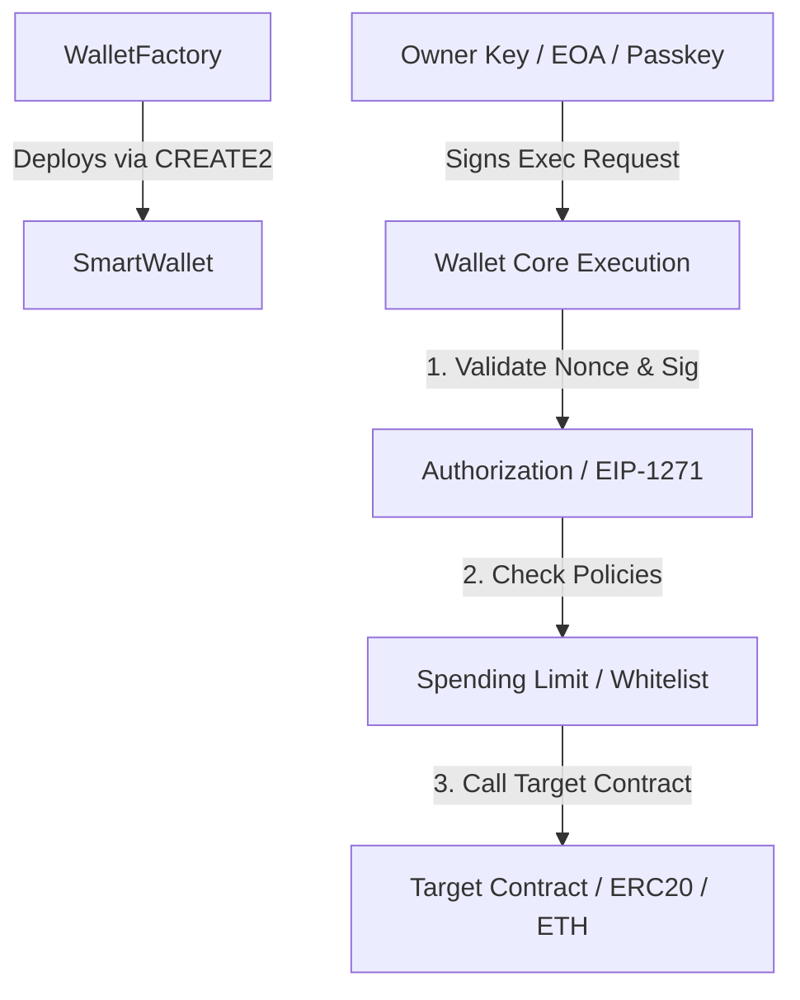

# Smart Contract Wallet - Architecture Specification

## 1. System Overview

The **Smart Contract Wallet (SCW)** is an enterprise-grade, non-custodial wallet infrastructure built on the Ethereum Virtual Machine (EVM). Unlike traditional Externally Owned Accounts (EOAs)—where a private key directly controls on-chain assets—the SCW architecture decouples asset custody and execution logic from the cryptographic keypairs.

In this model, the account itself is a smart contract capable of executing arbitrary calls, enforcing granular access controls, managing nonces, validating custom signatures (such as EIP-1271 and ERC-4337 UserOperations), and enabling social/guardian recovery without compromising non-custodial ownership.

```
+-----------------------------------------------------------------------------------+
|                                  USER / CLIENT                                    |
|                               (Next.js Web App)                                   |
+----------------------------------------+------------------------------------------+
                                         |
                                         v
+-----------------------------------------------------------------------------------+
|                           @scw/wallet-core (Core Logic)                           |
|  - Key Management Interfaces          - Nonce & Replay Tracking                   |
|  - Transaction Builders & Serializers - Simulation & Validation Engines           |
+----------------------------------------+------------------------------------------+
                                         |
                                         v
+-----------------------------------------------------------------------------------+
|                        @scw/contracts (Contract Bindings)                         |
|  - Centralized ABIs                   - Type-safe Contract Interfaces             |
|  - Multi-chain Address Registry       - Deployment Descriptors                    |
+----------------------------------------+------------------------------------------+
                                         |  JSON-RPC / Viem
                                         v
+-----------------------------------------------------------------------------------+
|                                  EVM BLOCKCHAIN                                   |
|                                                                                   |
|  +---------------------------+             +----------------------------------+   |
|  |     SmartWallet (Proxy)   | <---------- |       WalletFactory (Creator)    |   |
|  |  - Execution Engine       |             +----------------------------------+   |
|  |  - Authorization Rules    |                                                    |
|  |  - Nonce Management       |             +----------------------------------+   |
|  |  - Guard / Policy Hooks   |             |   External Contracts / Tokens    |   |
|  +---------------------------+ ----------> |   - ERC-20 / ERC-721 / DeFi      |   |
|                                            +----------------------------------+   |
+-----------------------------------------------------------------------------------+
```

---

## 2. Monorepo Structure & Package Boundaries

The repository is organized as a strict modular monorepo using `pnpm` workspaces:

```
smart-contract-wallet/
├── apps/
│   └── web/                   # Next.js 14+ UI, React, Tailwind CSS, App Router
├── contracts/                 # Foundry project (Solidity smart contracts, tests, scripts)
├── packages/
│   ├── config/                # Shared ESLint, Prettier, and TypeScript base configs
│   ├── contracts/             # Centralized ABIs, addresses, typed contract bindings
│   ├── wallet-core/           # Framework-agnostic wallet client logic & state machines
│   └── types/                 # Shared TypeScript domain models & schemas
├── docs/                      # Architectural, security, and threat-model specifications
└── scripts/                   # Tooling, node runners (Anvil), and deploy scripts
```

### Strict Separation Rules:
1. **Zero UI logic in `@scw/wallet-core`**: Wallet core contains pure TypeScript functions and state classes without React hooks or DOM dependencies.
2. **Centralized ABI single-source-of-truth**: All smart contract artifacts compile from `contracts/` into `packages/contracts/`. No raw ABIs may be duplicated across frontend files.
3. **Strict Type Safety**: All domain data transfers between frontend and contracts use typed definitions in `@scw/types`.

---

## 3. Core Contract Architecture (Target Roadmap)



### Key Architectural Primitives (Phased Roadmap):
1. **Deterministic Deployment**: Deterministic wallet addresses computed via `CREATE2` before actual deployment on-chain.
2. **Replay Protection**: Nonce mechanisms (sequential and 2D/parallel nonces for multi-transaction pipelines) incorporating `chainId` and wallet contract address.
3. **EIP-1271 Standard**: Smart contract signature validation enabling contract wallets to interact with DeFi protocols, order books, and marketplaces.
4. **ERC-4337 Account Abstraction Compatibility**: Modular design capable of executing via standard direct calls or ERC-4337 `UserOperation` bundles and Paymasters.

---

## 4. Local Development Lifecycle

- **Local EVM Node**: Anvil running locally on port `8545` with chain ID `31337`.
- **Fast Feedback Loop**: Forge unit tests compile and run in sub-second cycles.
- **Frontend Development**: Next.js App Router hot-reloading with live connection to the local Anvil node.
